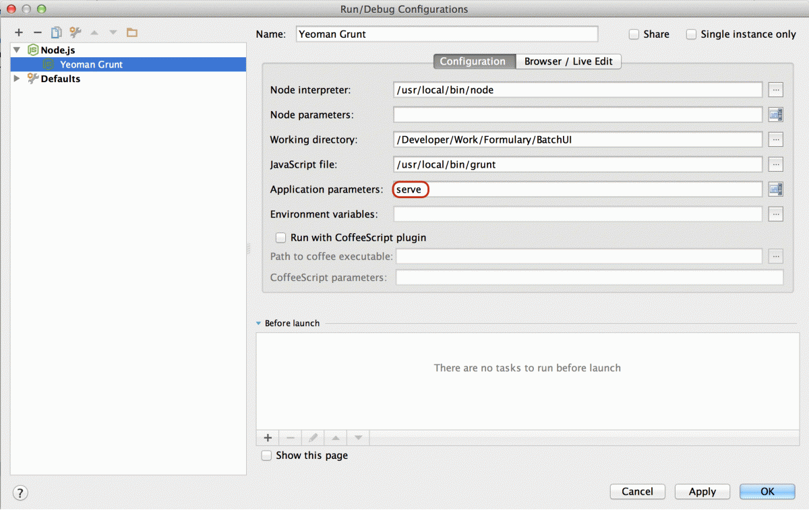

##Setup AngularJS project with Yeoman and WebStorm as IDE

###Setup new OSX 10.9 Mavericks for development (one time only step)

	1. Setup developer directory structure 
		create /Developer/Applications &  /Developer/Work directories.
		Install developer apps like WebStrom/IntelliJ or Sublime Text for frontend development and IntelliJ or eclipse/Spring STS/GGTS for Grails development in  /Developer/Applications
		Your project workspaces go in /Developer/Work
	2. Install Command Line Tools for OSX 10.9 Mavericks
		xcode-select —install 
	3. Install JDK
		java -version [will redirect to Oracle]
	4. Install Homebrew		
		ruby -e "$(curl -fsSL https://raw.github.com/mxcl/homebrew/go)”
		brew doctor
		brew update

###Install Yeomen on fresh Mac (one time only step)

	Note: make sure you have brew installed as documented above. 
	1. brew install node   # this will install node and npm
	2. npm install -g yo   # this will install yeoman, grunt and bower
	3. npm install -g generator-angular  # install angular generator

###WebStrom setup (one time only step)
>
1. Install WebStrom
2. Install AngularJS plugin
3. copy setup/Yeoman-ng_gen.xml to WebStorm's tools folder:  Windows `~/.WebStormX/config/tools/`  or Mac `~/Library/Preferences/WebStormX/tools/`
  1. Add some Yeoman-AngularJS commands to WebStorm's [Quick List] and create a [keymap] [alt+a]. [How to Link](http://www.screenr.com/xcI8)
  2. Open Run -> Edit Configurations... menu,  click + to add new Node.js configuration[name it as Yeoman Grunt] and change it as showed in the pictures below
  
  3. Install Chrome Extension 'JetBrains IDE Support' for JavaScript debugging with WebStorm [JavaScipt debugging only support on Chrome browser for now]
4. Create empty project e.g: ConsoleUI
5. Open [Tool>Open Terminal] and run commands from Step 2. and rest of the steps

###AngularJS work flow

####Scaffold out a AngularJS project

	1. mkdir ConsoleUI && cd $_		            # Creating app directory. #run this if you are not using WebStrom
	2. yo angular                               # scaffold out a AngularJS project.
	   #yo angular [app-name] 	                # if you want to name of app something other then the parent directory.
	   
	Note: If you checkout project from SCM, you may already have following components defined in bower.json. In this case just run `bower install`
	
	3. bower install --save bootstrap       	# install bootstrap for your project from Bower. If youman didnt install bootstrap
	5  bower install --save angular-bootstrap   # install a angular-bootstrap
	6. bower install --save restangular       	# https://github.com/mgonto/restangular#restangular
	7. bower install --save angular-ui-router   # lets use angular-ui-router as  angular-route  sucks
	8. bower install --save angular-http-auth#master   # intercepts 401 responses, and triggers login
	9. bower install --save angular-animate     # Angular animates
    9. bower install --save angular-resource    # angular-resource
    9. bower install --save angular-cookies		# angular-cookies
    9. bower install --save angular-sanitize    # anangular-sanitize
    10. bower install --save animate.css        # http://daneden.me/animate/
	11. bower install --save angular-growl      # Angular notifications
	12. bower install --save angular-translate  #  global i18n
	13. bower install --save angular-translate-loader-partial #load i18n files Asynchronously
	14. bower install --save angular-xeditable  # http://vitalets.github.io/angular-xeditable/
	15. bower install --save angular-cache      # better then http://jmdobry.github.io/angular-cache/guide.html#storage

####Other bower commands

	bower install                               # Install all the dependencies declared in bower.json
	bower register your_module_name             # Register your module with given name
	bower list                                  # To list installed packages.
	bower update                                # Update all dependencies
	bower update <package-name>                 # To update a package. e.g: bower update angular
	bower search <package-name>                 # To search for a package.
	bower install --save <package-name>#3.0.0   # To install a specific version. e.g: bower install angular\#1.2
	bower uninstall --save <package-name>   	# To Uninstalling packages.

####Bower dependencies injected automatically into your HTML(index.html) by Grunt
>
1. Do not manually edit `<!-- bower:css --> <!-- endbower -->` and `<!-- bower:js -->  <!-- endbower -->` sections in your `index.html` file.
2. Grunt automatically injects them for you, based on your bower.json
3. Only exception is when providers didn't include proper bower.json in their package. e.g:
  1. app/bower_components/angular-growl/bower.json
  2. app/bower_components/angular-translate-loader-partial/bower.json
4. In this case I will manually fix those bower.json files with correct 'main' section.

####Other grunt commands
    1. grunt bower-install      # To reference new js, css files in index.html
	2. grunt test               # Test your app
	3. grunt serve              # Preview your app
	4. grunt                  	# Build the application for deployment

####Other yo commands
	1. yo angular:route myRoute                    	# To create new route, controller and view
    2. yo angular:controller myController
    3. yo angular:controller myController --minsafe # for Minification Safe
    4. yo angular:controller myController --coffee  # if you are using coffeeScript
    5. yo angular:directive myDirective
    6. yo angular:filter myFilter
    7. yo angular:service myService

###SCM integration tips

####node_modules directory

As you can see if you take a look at the generated `.gitignore` file, `node_modules` directory cannot be committed. Other developers sharing the application project have to install dependent packages by running `npm install` after cloning the repository source codes.

####bower_components

As descrived above, `bower install` is required as `bower_components` is never shared by SCM as well as `node_modules`.

###Reference

[grunt-bower-install]: http://stackoverflow.com/questions/18422020/how-to-update-and-include-twitter-bootstrap-3-on-webapp-or-yo-angular/19034513#19034513
